# Отчёт по проекту: предсказание дохода домохозяйств Тульской области

**Студент:** Плясов Николай Викторович
**Группа:** БИВ231
---

## 1. Введение и постановка задачи

**Задача.** По характеристикам домохозяйства предсказать среднедушевой доход двумя способами:

- **Регрессия** — числовое значение `doxodn` (руб./мес. на человека)
- **Классификация** — входит ли домохозяйство в группу с доходом выше 75-го перцентиля (`doxodn > Q3 ≈ 151 400 руб.`)

**Метрики и почему именно они:**

| Задача | Ключевая метрика | Почему |
|--------|-----------------|--------|
| Регрессия | **R²** | Показывает долю объяснённой дисперсии — понятно без знания масштаба данных. Дополнительно смотрим RMSE и MAE. |
| Классификация | **ROC-AUC** | Классы несбалансированы (75% / 25%), поэтому Accuracy будет завышена даже у тривиального классификатора. ROC-AUC устойчива к дисбалансу. |

---

## 2. Поиск и описание данных

**Источник:** микроданные Росстата — «Выборочное наблюдение доходов населения и участия в социальных программах», 2023 год. Официальный сайт: rosstat.gov.ru → раздел «Выборочные наблюдения».

**Почему этот датасет:** официальный источник с прозрачной методологией; тема социального неравенства содержательно интересна; есть и непрерывная, и категориальная целевая переменная.

**Объём:** 193 256 домохозяйств × 42 признака (все регионы). После фильтрации по Тульской области (код `ter = 71`) — **3 803 записи**. При разделении 70/30 обучающая выборка составляет ~2 660 наблюдений — достаточно для моделей данного класса. Региональный срез убирает межрегиональную гетерогенность, которая могла бы искажать результаты.

**Признаки, используемые в моделях:**

| Признак | Описание |
|---------|----------|
| `chlico` | Число лиц в домохозяйстве |
| `chdet` | Число детей |
| `rasress` | Располагаемые ресурсы домохозяйства (руб.) |
| `rasq` | Среднедушевые располагаемые ресурсы (руб.) |
| `potras` | Расход на конечное потребление (руб.) |

Из 42 признаков отобраны 5. Исключены идентификаторы (`per`, `ter`, `mest`, `bud`) и узкоспециализированные индикаторы (наличие пенсионеров, инвалидов, конкретных источников дохода), которые описывают состав, а не ресурсный потенциал. Оставлены признаки, напрямую характеризующие ресурсный потенциал и демографическую нагрузку домохозяйства.

---

## 3. Обработка и подготовка данных

**Пропуски.** В 5 выбранных признаках и целевой переменной пропусков нет.

**Дубликаты.** Не обнаружены — каждая строка соответствует уникальному бюджетному номеру (`bud`).

**Выбросы.** Не удалялись: высокие значения дохода и расходов отражают реальное неравенство, а не ошибки измерения.

**Feature engineering:**
- Создана бинарная переменная `doxodn_high = 1`, если `doxodn > Q3` (151 400 руб.)
- Для ассоциативных правил все признаки бинаризованы по медиане (`<feature>_high`)

**Разделение данных:**

| Задача | Пропорция | Стратификация |
|--------|-----------|--------------|
| Регрессия | 70 / 30 | нет |
| Классификация | 70 / 30 | по `doxodn_high` |
| PCA-регрессия | 60 / 40 | нет |

**Утечка данных исключена:** `StandardScaler` обучается только на train, к test применяется только `transform`. Целевая переменная в признаках не присутствует.

**Визуализации EDA** — `notebooks/01_eda.ipynb`:

- Распределение `doxodn`: правостороннее, медиана ≈ 118 000 руб.

  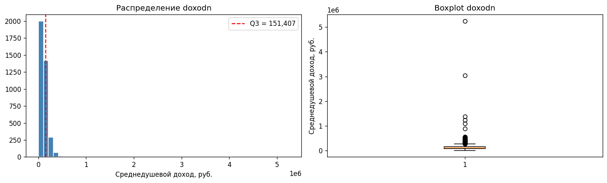

- Scatter plots: `rasress` и `rasq` — сильная положительная корреляция с доходом; `chlico` — отрицательная.

  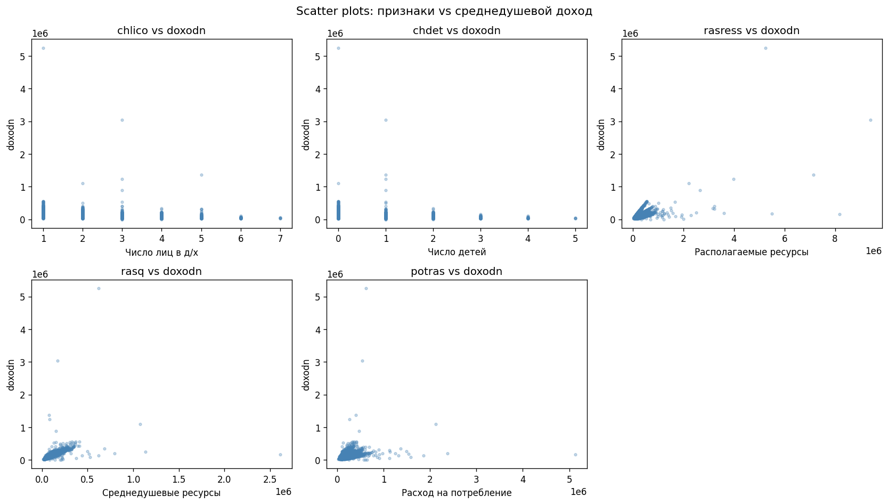

- Матрица корреляций: `rasress` (r = 0.59), `rasq` (r = 0.50) — наиболее значимые предикторы. `chlico` и `chdet` — отрицательная корреляция (−0.26 и −0.19).

  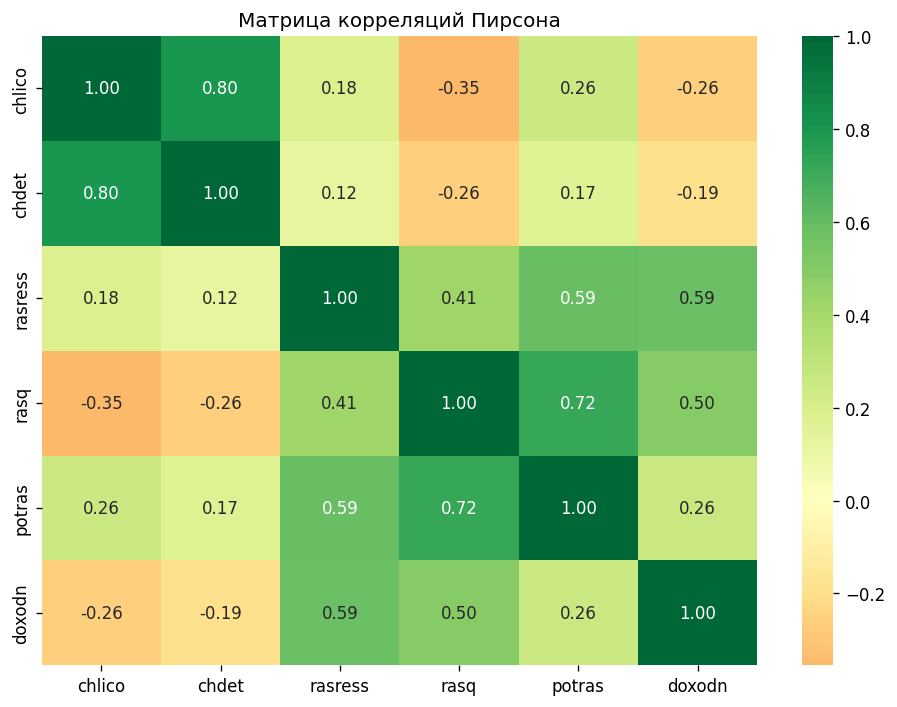

- Распределения признаков по группам выше/ниже Q3.

  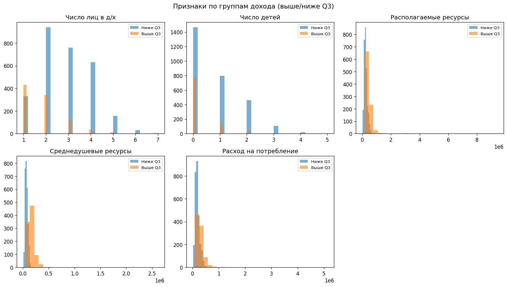

---

## 4. Baseline-модель

Простые модели «из коробки» без какого-либо отбора признаков или инженерии — точка отсчёта для всех последующих экспериментов.

| Модель | Задача | R² test | ROC-AUC test | Accuracy test |
|--------|--------|---------|-------------|--------------|
| LinearRegression | регрессия | 0.755 | — | — |
| LogisticRegression (все 5 признаков) | классификация | — | 0.984 | 0.934 |
| KNN (k=5) | классификация | — | 0.991 | 0.970 |

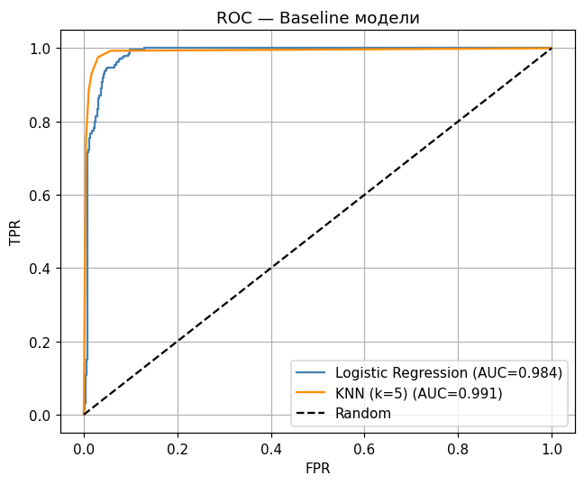

Цель экспериментов — превзойти **R² = 0.755** для регрессии и **ROC-AUC = 0.984** для классификации.

---

## 5. Эксперименты

Все эксперименты — `notebooks/02_baseline.ipynb` и `notebooks/03_experiments.ipynb`.

---

### 5.1 Полиномиальная регрессия

**Гипотеза:** нелинейные зависимости между признаками и доходом улучшат качество регрессии.

**Проверка:** обучили LinearRegression на полиномиальных признаках степеней 1–8, сравнили R² train/test.

**Результат:**

| Степень | R² train | R² test |
|---------|----------|---------|
| 1 | 0.534 | 0.755 |
| **2** | **0.77** | **0.80** |
| 3 | 0.92 | 0.50 |
| 4+ | →1.00 | <0 |

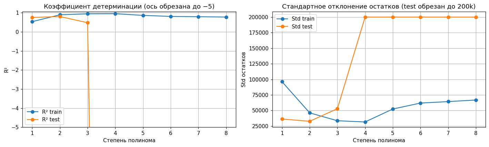

Степень 2 даёт прирост R² с 0.755 до **0.80**. Степень ≥ 3 — переобучение.

---

### 5.2 PCA + линейная регрессия

**Гипотеза:** сжатие признаков через PCA снизит шум и улучшит обобщение.

**Проверка:** PCA на всех 5 признаках, выбрали число компонент с суммарной дисперсией ≥ 70%, обучили LinearRegression.

**Результат:** 9 компонент объясняют >70% дисперсии. R² test = **0.750** — хуже, чем полином степени 2, потому что часть информации теряется при сжатии. На scatter-plot PC1–PC2 классы частично разделимы вдоль первой компоненты.

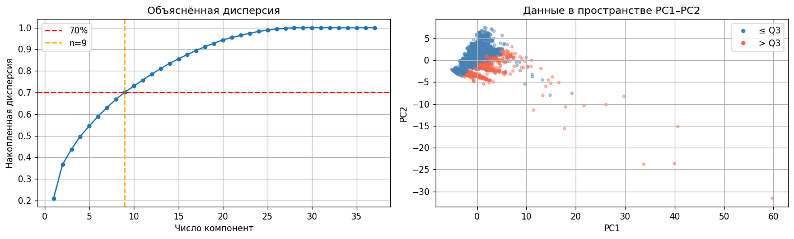

---

### 5.3 Логистическая регрессия с RFE

**Гипотеза:** отбор признаков уберёт шум и улучшит классификацию.

**Проверка:** RFE (Recursive Feature Elimination) с логистической регрессией, `n_features_to_select=3`.

**Результат:** отобраны `chlico`, `chdet`, `rasress`.

| Метрика | Train | Test |
|---------|-------|------|
| Accuracy | 0.966 | 0.961 |
| ROC-AUC | 0.990 | **0.988** |

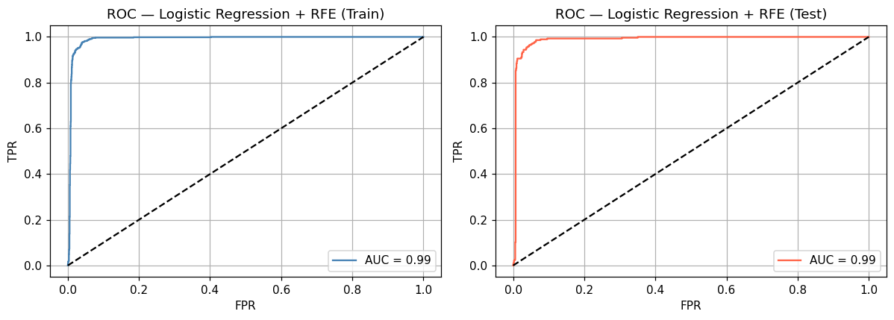

ROC-AUC вырос с 0.984 до **0.988** (+0.4%), Accuracy — с 0.934 до 0.961. Коэффициент `chlico` отрицательный (−4.38): больше людей → ниже доход на душу. `rasress` — положительный.

---

### 5.4 Random Forest — перебор гиперпараметров

**Гипотеза:** ансамбль деревьев превзойдёт логистическую регрессию; оптимальная глубина важна.

**Проверка:** перебор `n_estimators` ∈ {50, 100, 200} × `max_depth` ∈ {1, 2, 3, 5, None} (15 комбинаций).

**Результат (топ-5 по ROC-AUC):**

| n_estimators | max_depth | ROC-AUC test | Accuracy test |
|-------------|-----------|-------------|--------------|
| 50 | None | **0.998** | **0.982** |
| 100 | None | 0.998 | 0.982 |
| 200 | None | 0.997 | 0.982 |
| 50 | 5 | 0.996 | 0.972 |
| 200 | 5 | 0.995 | 0.972 |

Оптимум: `max_depth=None` — неограниченная глубина деревьев. Мелкие деревья (depth=2) дают ROC-AUC=0.977, что заметно хуже.

Ключевой признак по MDI, MDA и SHAP — `rasq`.

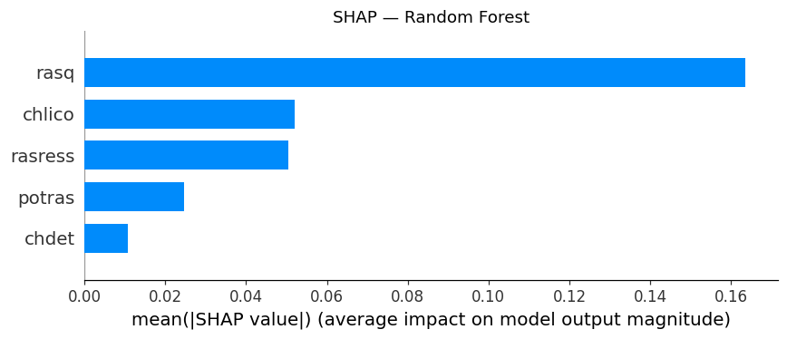

---

### 5.5 Градиентный бустинг (GBM) — перебор гиперпараметров

**Гипотеза:** бустинг точнее Random Forest за счёт последовательного исправления ошибок.

**Проверка:** перебор `learning_rate` ∈ {0.01, 0.05, 0.1, 0.2} × `max_depth` ∈ {1, 2, 3} (12 комбинаций).

**Результат (топ-5 по ROC-AUC):**

| learning_rate | max_depth | ROC-AUC test | Accuracy test |
|--------------|-----------|-------------|--------------|
| 0.10 | 3 | **0.997** | **0.982** |
| 0.20 | 3 | 0.997 | 0.983 |
| 0.20 | 2 | 0.996 | 0.983 |
| 0.05 | 3 | 0.996 | 0.977 |
| 0.10 | 2 | 0.996 | 0.978 |

Оптимум: `lr=0.1`, `max_depth=3`. GBM на максимальных конфигурациях сопоставим с RF (оба ~0.997), однако деревья глубиной 3 управляемее и легче интерпретируются, чем неограниченные деревья RF.

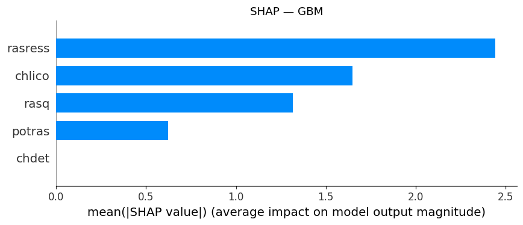

---

### 5.6 XGBoost — регрессия, перебор max_depth

**Гипотеза:** градиентный бустинг для регрессии даст прирост над полиномиальной регрессией и LinearRegression.

**Проверка:** XGBRegressor, перебор `max_depth` ∈ {2, 3, 5, 7, 10}.

**Результат:**

| max_depth | R² test | RMSE test | MAE test |
|-----------|---------|-----------|----------|
| 2 | 0.823 | 30 800 | 9 800 |
| 5 | 0.851 | 28 200 | 8 400 |
| **7** | **0.866** | **26 767** | **7 328** |
| 10 | 0.861 | 27 200 | 7 600 |

XGBoost (R² = **0.866**) лучше LinearRegression на 11%, MAE в 3.5 раза ниже. Ключевые признаки: `potras` (gain), `rasress`, `rasq` (total gain).

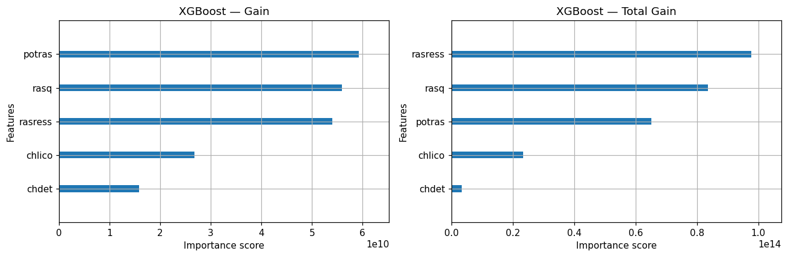

---

### 5.7 Ассоциативные правила (Apriori и FP-Growth)

**Гипотеза:** в данных есть устойчивые паттерны совместного появления признаков, связанные с высоким доходом.

**Проверка:** бинаризация всех признаков по медиане → Apriori и FP-Growth с `min_support=0.05`, `min_confidence=0.5`.

**Результат:** оба алгоритма дают идентичные топ-правила. Сильнейшее (lift = 5.29):

> `{chlico_high, rasq_high}` → `{chdet_high, doxodn_high, potras_high, rasress_high}`  
> support = 0.103, confidence = 0.731

Крупные семьи с высокими среднедушевыми ресурсами одновременно имеют высокий доход, число детей и потребление. Совпадение результатов подтверждает устойчивость паттернов.

---

## 6. Финальная модель и интерпретируемость

### Классификация: GBM (`n_estimators=100`, `max_depth=2`, `learning_rate=0.1`)

| Метрика | Train | Test |
|---------|-------|------|
| Accuracy | 0.982 | 0.978 |
| ROC-AUC | 0.997 | **0.996** |
| F1 (класс 1) | 0.97 | **0.96** |

Выбор обоснован тремя критериями:
1. **Качество:** ROC-AUC = 0.996, F1 = 0.96 — лучшие среди сравнимых конфигураций (max_depth=2). Оптимальный RF с max_depth=None достигает 0.998, но ценой неограниченной глубины деревьев.
2. **Устойчивость:** разрыв train/test минимален (0.997 vs 0.996) — переобучения нет.
3. **Интерпретируемость:** SHAP-анализ согласован с MDI и MDA.

### Регрессия: XGBoost (`n_estimators=100`, `max_depth=7`)

| Метрика | Train | Test |
|---------|-------|------|
| R² | 0.978 | **0.866** |
| RMSE | — | 26 767 руб. |
| MAE | — | 7 328 руб. |

### Сводное сравнение — классификация

| Модель | Accuracy | ROC-AUC | F1 (класс 1) |
|--------|----------|---------|--------------|
| KNN k=5 (baseline) | 0.970 | 0.991 | — |
| Logistic (baseline) | 0.934 | 0.984 | — |
| Logistic + RFE | 0.961 | 0.988 | 0.92 |
| Random Forest (max_depth=2) | 0.931 | 0.976 | 0.85 |
| **GBM (max_depth=2)** | **0.978** | **0.996** | **0.96** |

### Важность признаков

| Признак | Роль |
|---------|------|
| `rasq` | Ведущий предиктор по MDI (RF и XGBoost) |
| `rasress` | Лидер по MDA и SHAP — суммарные ресурсы семьи |
| `chlico` | Отрицательный фактор: больше людей → ниже доход на душу |
| `potras` | Важен для XGBoost-регрессии (gain) |
| `chdet` | Значим, но уступает `chlico` |

Совпадение лидирующих признаков в трёх разных методах (MDI, MDA, SHAP) говорит об устойчивости интерпретации.

---

## 7. Деплой

Реализован REST API (FastAPI) и веб-интерфейс (Streamlit).

**Запуск:**
```bash
docker compose up api streamlit
```

**API** (`http://localhost:8000`):
- `POST /predict` — принимает 5 признаков, возвращает предсказание дохода (XGBoost) и вероятность попасть в группу выше Q3 (GBM)
- `GET /docs` — автогенерированная документация (Swagger UI)

**Streamlit** (`http://localhost:8501`): форма с вводом характеристик домохозяйства, результат отображается в двух метриках.

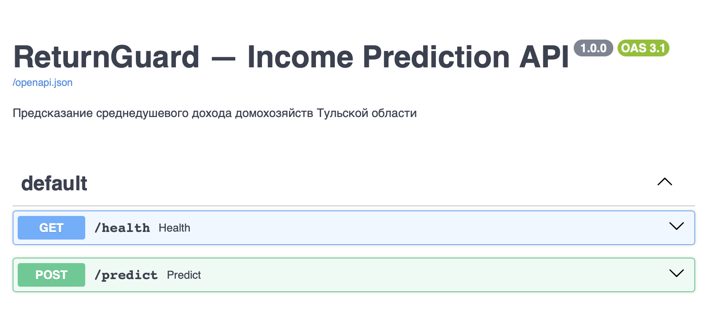

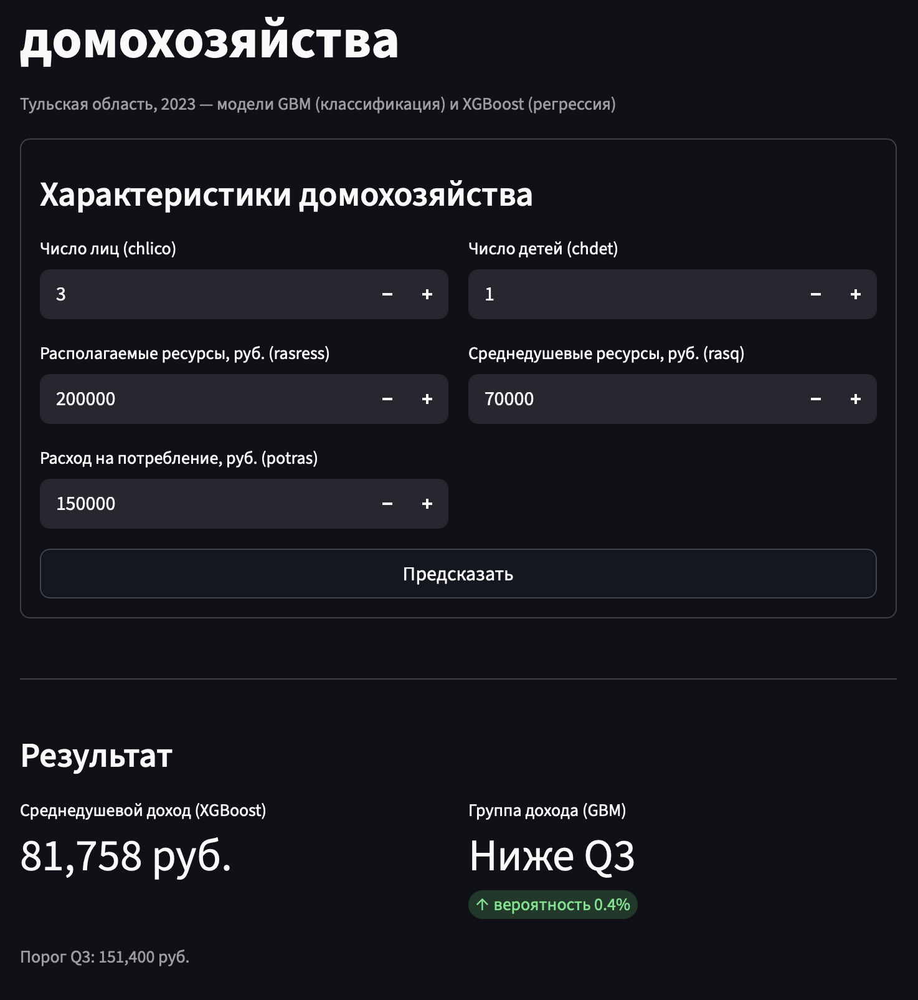

**Видео:** [Веб приложение](https://disk.yandex.ru/i/88SQiZW76BTehA)

---

## 8. Заключение и выводы

**Что сделано:**
- Построены регрессионная и классификационная модели на микроданных Росстата по Тульской области (3 803 домохозяйства)
- Протестировано 7 подходов, для двух лучших проведён перебор гиперпараметров
- Финальные результаты: ROC-AUC = **0.996** (GBM), R² = **0.866** (XGBoost)
- Реализован деплой через FastAPI + Streamlit в Docker

**Главный вывод:** располагаемые ресурсы (`rasress`, `rasq`) — ключевые предикторы дохода, а численность домохозяйства (`chlico`) снижает доход на душу — это согласуется с экономической теорией.

**Ограничения:**
- Использованы 5 из 42 доступных признаков — остальные 37 не рассматривались, так как отбор производился вручную на основе содержательного смысла; автоматического отбора по всем признакам не проводилось
- Данные за один год — временна́я динамика не учитывается, поскольку Росстат публикует аналогичные микроданные ежегодно, но объединение нескольких волн выходило за рамки задачи
- Региональная выборка (Тульская область) — результаты не обобщаются на другие регионы напрямую, так как межрегиональная гетерогенность доходов существенна и требует отдельного анализа
- XGBoost-регрессия имеет заметный разрыв train/test (R² 0.978 vs 0.866) — переобучение обусловлено большой глубиной деревьев (`max_depth=7`) и отсутствием тюнинга регуляризации (lambda, alpha); перебор проводился только по `max_depth`

**Возможные улучшения:**
- Подключить все 37 числовых признаков и провести отбор через SHAP или RFE
- Тюнинг гиперпараметров через Optuna вместо ручного перебора
- Добавить данные за несколько лет для учёта временно́й динамики
- Попробовать LightGBM и CatBoost как альтернативы XGBoost
